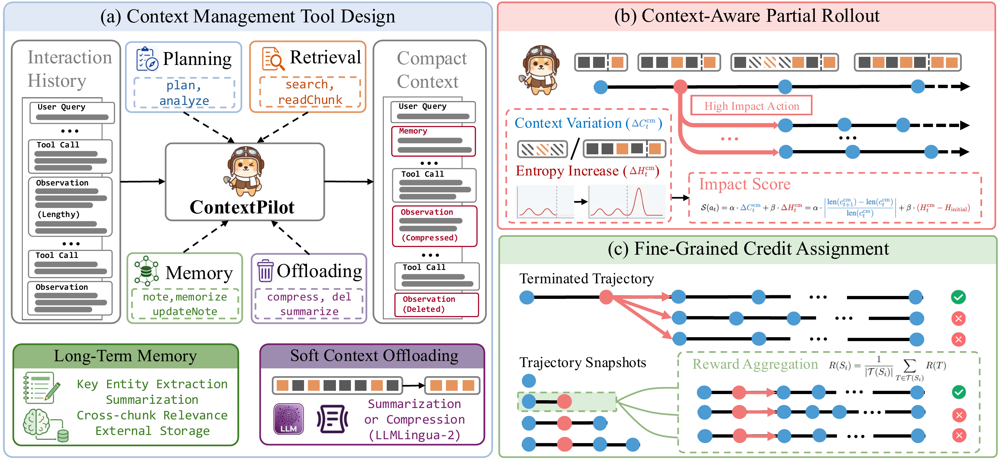

# ContextPilot

<p align="center">
  <a href="https://github.com/Tencent/ContextPilot">
    
  </a>
  <a href="https://tencent.github.io/ContextPilot/">
    
  </a>
  <a href="">
    
  </a>
  <a href="https://huggingface.co/collections/panzs19/contextpilot">
    
  </a>
  <a href="https://github.com/Tencent/ContextPilot/tree/main#setup">
    
  </a>
</p>

ContextPilot extends context management with planning, structured memory, and
soft context offloading. Its context-aware partial rollout focuses exploration
on sensitive context-editing decisions, while fine-grained credit assignment
trains intermediate snapshots using the outcomes of their downstream
branches.
Experiments on long-context QA and deep search tasks show that ContextPilot
achieves stronger performance with a more compact working context,
outperforming existing baselines across various base models and benchmarks.



## Setup

### 1. Inference environment

Install the inference dependencies with the provided setup script:

```bash
bash infer/scripts/setup_environment.sh
source infer/.venv/bin/activate
```

### 2. Elasticsearch

ContextPilot's `searchEngine` tool requires Elasticsearch. The setup script
installs a local Elasticsearch distribution, and the full evaluation launcher
starts it automatically. To run the service separately:

```bash
bash infer/scripts/start_elasticsearch.sh
```

### 3. Judge configuration

LongMemEval and BrowseComp+ use an OpenAI-compatible judge. Store its endpoint
configuration in a JSON file and set:

```bash
export JUDGE_OPENAI_FILE=/path/to/judge-endpoint.json
```

See the [inference guide](infer/README.md) for endpoint configuration and other
runtime options.

## Evaluation

The evaluation suite covers:

- **InfBench:** the `longbook_choice_eng` split from
  [InfiniteBench](https://huggingface.co/datasets/lindsay21/InfiniteBench),
  loaded automatically from Hugging Face.
- **NovelQA:** its answer annotations cannot be redistributed. Request full
  access from the
  [NovelQA dataset page](https://huggingface.co/datasets/NovelQA/NovelQA#request-full-accesss).
- **LongMemEval:** the benchmark data is included at
  `infer/data/LongMemEval/longmemeval_s_cleaned.json`.
- **BrowseComp+:** the original obfuscated parquet data is included at
  `infer/data/BrowseCompPlus/data/`. Prepare a local decrypted JSONL with
  [`infer/scripts/prepare_browsecomp_plus.py`](infer/scripts/prepare_browsecomp_plus.py).

The LongMemEval and BrowseComp+ data files are tracked with Git LFS; after
cloning, run `git lfs install && git lfs pull` to download them.

Evaluate a checkpoint on all four tasks:

```bash
bash infer/scripts/run_full_pipeline.sh /path/to/checkpoint my-run
```

The pipeline starts the required services, runs each benchmark, and writes
predictions, trajectories, and scores to `infer/results/`. Individual tasks can
be run with:

```bash
bash infer/scripts/eval_infbench.sh /path/to/checkpoint my-run
bash infer/scripts/eval_novelqa.sh /path/to/checkpoint my-run
bash infer/scripts/eval_longmemeval.sh /path/to/checkpoint my-run
bash infer/scripts/eval_browsecomp_plus.sh /path/to/checkpoint my-run
```

To adapt the runner to another HuggingFace-styled dataset, refer to the dataset
processing and evaluation examples in
[GitHub - xyliu-cs/StateLM: [ICLR'26] Official Open-source Implementation of StateLM](https://github.com/xyliu-cs/StateLM#evaluation).

## Training

The RL implementation is built on verl and includes context-aware partial
rollout and snapshot-level credit assignment. Set up the training environment
following the [training guide](train/README.md), then launch the 8B recipe with:

```bash
cd train

TRAIN_FILE=/path/to/train.parquet \
VAL_FILE=/path/to/validation.parquet \
MODEL_PATH=/path/to/qwen3-8b \
GPUS_PER_NODE=8 \
bash sh/run_qwen3-8b_longbenchv2.sh
```

For Qwen3-14B, use `sh/run_qwen3-14b_longbenchv2.sh`.

## Acknowledgements

ContextPilot builds on the ideas and implementations of StateLM, verl, vLLM,
and the open-source benchmark projects used in the paper. We thank their
authors and maintainers.

## Citation

Citation details will be added with the public paper release.
